# How to contribute changes

## Steps

1. [Build and run/debug the extension](#build-and-rundebug-the-extension).
2. Make your change, including:
    1. The change itself.
    2. Update the `version` in [package.json](package.json).
    3. Update [CHANGELOG.md](CHANGELOG.md) with the release notes for the new version.
3. [Run/debug tests](#rundebug-tests).
4. Submit a [pull request](https://github.com/harrisont/fastbuild-vscode/pulls) with the change for review.
5. Once the PR is accepted, create a new release, using a new release tag for the new version. Include the release notes from [CHANGELOG.md](CHANGELOG.md). This will automatically publish the extension to the VS Code Marketplace via the GitHub Action.

## Build and run/debug the extension

1. Run `npm install` in this folder. This installs all necessary npm modules in both the client and server folder.
2. Open VS Code on this folder.
3. Run the `build` task, which builds the client and server. Alternatively, run the `watch-build` task to watch for changes and automatically build.
4. Run the `Launch Client` launch configuration. If you want to debug the server as well, use `Launch Client + Server` instead.

## Run/debug Tests

* Run the `test` task. Alternatively, run the `watch-test` task to watch for changes and automatically run tests.
* Debug the tests by running the `Run Tests` launch configuration.

## About the code

```mermaid
flowchart TB
    RawGrammar["Raw grammar (fbuild-grammar.ne)"] -->|0. Nearley compiler produces| CompiledGrammar[fbuild-grammar.ts]
    subgraph Extension
        LanguageClient["Language client (extension.ts)"] <-->|"1. Document changed (Language Server Protocol)"| FileUpdate[[updateDocument]]
        subgraph LanguageServer["Language server (server.ts)"]
            FileUpdate -->|2. parse| ParseDataProvider[parseDataProvider.ts]
            ParseDataProvider -->|3. read file| FileContentProvider["fileContentProvider (fileSystem.ts)"]
            FileContentProvider -->|4. cache| FileCache[(File cache)]
            ParseDataProvider -->|5. parse| Parser[parser.ts]
            Parser -->|6. parse| CompiledGrammar
            ParseDataProvider -->|7. cache| ParseCache[(Parse cache)]
            FileUpdate -->|8. evaluate| Evaluator[evaluator.ts]
            Evaluator -->|"9. parse (for #include)"| ParseDataProvider
            FileUpdate -->|10. cache| EvaluatedDataCache[(Evaluated data cache)]

            subgraph FeatureProviders[Feature providers]
                HoverProvider
                DefinitionProvider
                ReferenceProvider
                DiagnosticProvider
            end
            FeatureProviders --> EvaluatedDataCache

            FileUpdate -->|11. Update diagnostics| DiagnosticProvider
        end
        LanguageClient <-->|12. Other Language Server Protocol messages| FeatureProviders
    end

    style Extension fill:#555
    style LanguageServer fill:#444
    style FeatureProviders fill:#333
```

* [parser.ts](server/src/parser.ts) parses FASTBuild files.
    * It uses the [Nearley](https://nearley.js.org/) parser generator, which lexes using [moo](https://github.com/no-context/moo).
        * [Nearley Parser Playground](https://omrelli.ug/nearley-playground/)
        * Example: [Moo.js Tokenizer with Nearley.js](https://www.youtube.com/watch?v=GP91_duEmk8)
    * It uses the FASTBuild grammaer defined in [fbuild-grammar.ne](server/src/fbuild-grammar.ne).
* [evaluator.ts](server/src/evaluator.ts) evaluates the parsed input.
* The lanaguage server ([server.ts](server/src/server.ts)) uses [feature providers](server/src//features/) to implement the server's capabilities.
* VS Code language server extension resources:
    * [VS Code Language Server Extension Guide](https://code.visualstudio.com/api/language-extensions/language-server-extension-guide)
    * [How to create a language server and VS Code extension](https://github.com/donaldpipowitch/how-to-create-a-language-server-and-vscode-extension)
    * [Language Server Protocol: A Language Server For DOT With Visual Studio Code](https://tomassetti.me/language-server-dot-visual-studio/)
